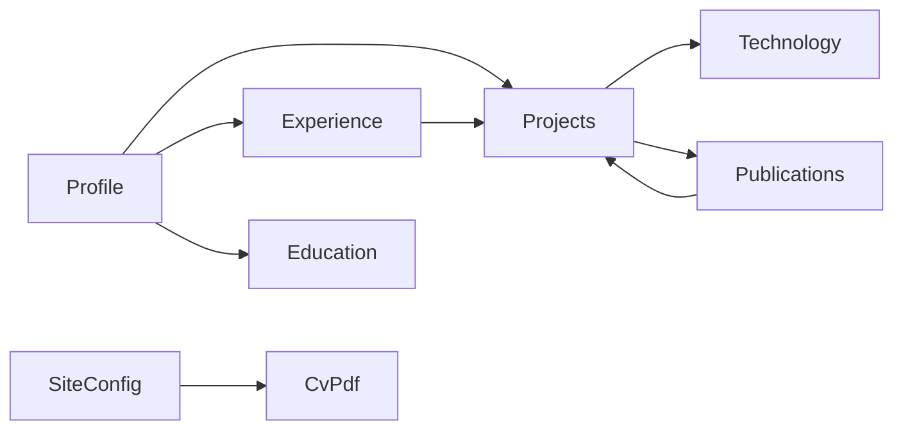

# SPECS.md

## 1) Goal

Build personal portfolio for developer and graduate student using Svelte, fully static deployment, content-first workflow.

This document defines:
- product scope
- information architecture
- YAML data contracts
- entity relationships
- routing/rendering strategy
- CV PDF integration strategy
- non-functional requirements
- phased delivery and acceptance criteria

## 2) Product Boundaries

### In Scope
- Static website only (no backend, no authentication, no runtime database).
- Build-time data loading from YAML files inside repository.
- Project, experience, education, publication, and profile pages from structured content.
- CV PDF button linked to remote latest artifact/release from dedicated CV repository.
- Relationship exploration UI (filters, tags, technology links, graph-like navigation).

### Out of Scope
- User accounts, admin panels, CMS.
- Server-side personalized logic.
- Runtime API calls for primary portfolio content.
- Editing content in browser.

## 3) Target Stack and Architecture

### Platform
- Svelte + static adapter output.
- Content stored in `/content` as YAML.
- Build-time validation layer to enforce schema and references.

### Architecture Principles
- Content is source of truth; UI consumes typed/validated data.
- Stable IDs/slugs for deterministic routes.
- Progressive enhancement: base content readable without advanced JS interactions.
- Fail fast in build if content invalid.

## 4) Information Architecture

- **Home**: identity, short positioning statement, highlighted projects, quick links.
- **About**: longer bio, values, interests, focus domains (fullstack, AI, research).
- **Projects**: gallery view, filters by technology/category/year, detail pages.
- **Experience**: internships/work timeline, detail pages with outcomes and linked projects.
- **Education & Research**: degrees, thesis, selected publications/talks.
- **CV**: call-to-action pointing to remote latest PDF with version/date metadata.
- **Contact**: static links (email, GitHub, LinkedIn, website profiles).

## 5) Content Layout

```text
/content
  profile.yaml
  site.yaml
  education/
    <education-slug>.yaml
  publications/
    <publication-slug>.yaml
  technologies.yaml
  projects/
    <project-slug>.yaml
  experience/
    <experience-slug>.yaml
```

Notes:
- One file per project/experience/education/publication entry improves diffs and review.
- Shared taxonomies in central files (`technologies.yaml`) prevent duplication.

## 6) YAML Contracts

All entities must include:
- `id`: immutable unique identifier, lowercase kebab-case.
- `slug`: URL slug, lowercase kebab-case.
- `title` or `name` depending on entity type.

Dates use ISO 8601 (`YYYY-MM` or `YYYY-MM-DD`).

### 6.1 `profile.yaml`

```yaml
id: profile-main
name: Jane Doe
headline: Fullstack and AI engineer
location: Paris, France
summary: >
  Builder focused on production web systems, AI features, and research-driven engineering.
roles:
  - fullstack-developer
  - graduate-student
links:
  github: https://github.com/username
  linkedin: https://linkedin.com/in/username
  email: mailto:me@example.com
skillsHighlight:
  - svelte
  - typescript
  - python
```

### 6.2 `site.yaml`

```yaml
siteName: Jane Doe Portfolio
baseUrl: https://example.com
defaultSeo:
  title: Jane Doe - Portfolio
  description: Fullstack, AI, and research portfolio.
  image: /og-default.png
cv:
  cvPdfUrl: https://github.com/<org>/<cv-repo>/releases/latest/download/cv.pdf
  label: Download CV
  lastVerified: 2026-04-30
navigation:
  - label: Home
    href: /
  - label: Projects
    href: /projects
  - label: Experience
    href: /experience
  - label: Education
    href: /education
  - label: CV
    href: /cv
```

### 6.3 `technologies.yaml`

```yaml
technologies:
  - id: svelte
    slug: svelte
    label: Svelte
    category: frontend
  - id: fastapi
    slug: fastapi
    label: FastAPI
    category: backend
  - id: pytorch
    slug: pytorch
    label: PyTorch
    category: ai-ml
```

### 6.4 `projects/<slug>.yaml`

```yaml
id: proj-portfolio
slug: portfolio-site
title: Portfolio Site
subtitle: Static Svelte portfolio with structured content
status: active
featured: true
startDate: 2026-04
endDate:
summary: Personal platform for projects, research, and experience.
description: >
  Built with static rendering, YAML content model, and schema validation.
technologies:
  - svelte
  - typescript
references:
  demoUrl: https://example.com
  repoUrl: https://github.com/username/portfolio
  paperUrl:
relatedExperience:
  - exp-software-intern
relatedPublications:
  - pub-portfolio-method
highlights:
  - Build-time content validation
  - Linked entities and filters
```

### 6.5 `experience/<slug>.yaml`

```yaml
id: exp-software-intern
slug: software-intern-acme
title: Software Engineer Intern
organization: Acme Corp
location: Remote
employmentType: internship
startDate: 2025-06
endDate: 2025-09
summary: Delivered internal tooling and AI-assisted workflows.
details:
  - Designed service interfaces for analytics ingestion.
  - Improved performance for dashboard data processing.
technologies:
  - python
  - fastapi
linkedProjects:
  - proj-portfolio
```

### 6.6 `education/<slug>.yaml`

```yaml
id: edu-msc-cs
slug: msc-computer-science
institution: Example University
degree: MSc Computer Science
startDate: 2024-09
endDate: 2026-07
focus:
  - machine-learning
  - distributed-systems
thesisTitle: Scalable Retrieval-Augmented Systems
```

### 6.7 `publications/<slug>.yaml` (optional but supported)

```yaml
id: pub-portfolio-method
slug: portfolio-method-paper
title: Structured Content for Developer Portfolios
venue: arXiv
year: 2026
url: https://arxiv.org/abs/xxxx.xxxxx
relatedProjects:
  - proj-portfolio
relatedExperience:
  - exp-software-intern
```

## 7) Entity Relationships and Rules

### Relationship map



### Reference integrity rules
- Every reference ID must resolve to an existing entity.
- `Project.technologies[]` must exist in `technologies.yaml`.
- `Project.relatedExperience[]` must exist in `/content/experience`.
- `Project.relatedPublications[]` must exist in `/content/publications` if present.
- `Experience.linkedProjects[]` must exist in `/content/projects`.
- No duplicate `id` values across same entity collection.

### Routing rules
- Collection pages: `/projects`, `/experience`, `/education`, `/cv`.
- Detail pages: `/projects/[slug]`, `/experience/[slug]`.
- Slug uniqueness enforced per entity type.

## 8) Rendering and Interaction Strategy (Svelte)

### Build-time pipeline
1. Load all YAML files.
2. Parse into typed objects.
3. Validate schema and references.
4. Generate static pages and route data.
5. Fail build on any validation error.

### UI components
- `Hero` for identity block.
- `ProjectCard` and `ProjectGrid`.
- `Timeline` for experience/education.
- `TagFilter` for technology/category filtering.
- `RelationshipPanel` to surface linked entities.

### Graph/relationship UX
- Minimum implementation: linked chips and “related items” sections.
- Optional enhancement: dedicated graph view page using static dataset (still no backend).

## 9) CV PDF Integration Spec

### Source of truth
- `site.yaml` key: `cv.cvPdfUrl`.
- Expected format: stable “latest release download URL” from CV repository.

### Runtime behavior
- CV button opens `cv.cvPdfUrl` in new tab.
- CV page shows:
  - download button
  - last verification date (`cv.lastVerified` if available)
  - fallback text if URL missing in config

### Build-time checks
- Validate `cvPdfUrl` has `https://` and is non-empty.
- If invalid/missing:
  - do not break full site build
  - show disabled CV action and visible warning text in CV page
- Future extension: CI job that probes URL and updates `lastVerified`.

## 10) Non-Functional Requirements

- **Performance**: static-first pages, limited client-side hydration.
- **Accessibility**: semantic headings/landmarks, keyboard navigation, descriptive link text, image alt text.
- **SEO**: page-specific title/description, Open Graph defaults from `site.yaml`.
- **Maintainability**: add or edit entries by YAML only; no component edits for normal content updates.
- **Reliability**: content validation prevents broken references reaching production.

## 11) Delivery Phases

1. **Foundation**
   - setup Svelte static structure
   - define YAML schemas and validation
   - implement core route map
2. **Core Content Pages**
   - home/about/contact
   - projects list + detail
   - experience list + detail
   - education/research page
3. **Relationship UX**
   - technology filters
   - related entities sections
   - optional graph visualization page
4. **CV + Quality Pass**
   - CV page/button with remote PDF config
   - accessibility pass
   - SEO metadata pass
   - performance optimization pass

## 12) Acceptance Criteria

- New profile/project/experience content can be added by YAML only.
- All project and experience detail pages are generated statically from slugs.
- `cv.cvPdfUrl` controls CV button destination.
- Missing or broken entity references are caught by build-time validation.
- Site remains functional and understandable without backend services.
- Main pages meet baseline accessibility and SEO metadata requirements.

